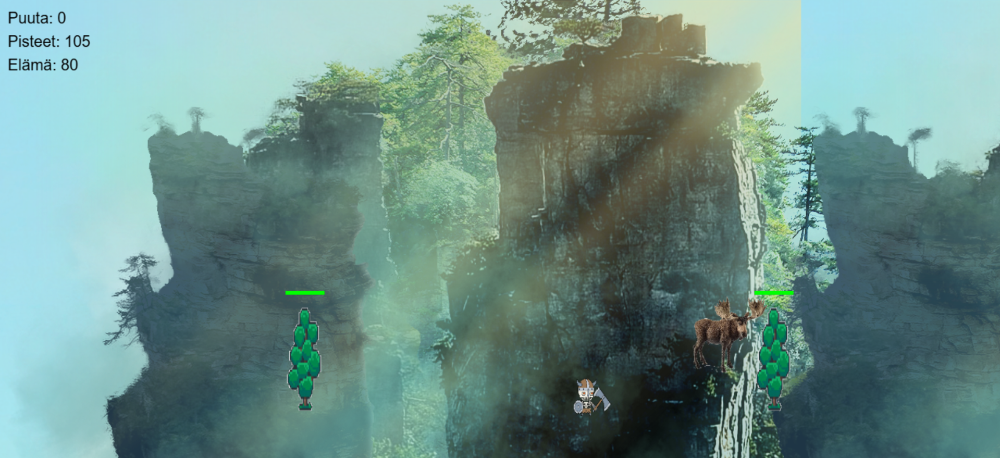

# Suomalainen Metsäseikkailu

## Kuvaus
Suomalainen Metsäseikkailu on toimintapeli, jossa pelaaja ohjaa suomalaista hahmoa metsässä. Peli sisältää erilaisia haasteita kuten karhuja, hirviä ja puiden kaatamista.

## Ohjaus
- A/D tai nuolinäppäimet: Liikkuminen
- Välilyönti: Hyppy
- S tai nuoli alas: Kyykky
- G: Ampuminen
- F: Puiden kaataminen

## Tavoitteet
- Kerää puuta kaatamalla puita (F-näppäin)
- Vältä karhuja ja hirviä
- Voita hyppäämällä vihollisten yli tai ampumalla niitä
- Kerää pisteitä ja puuta voittaaksesi pelin

## Tekniikka
Peli on toteutettu JavaScriptillä ja HTML5 Canvas-tekniikalla. Se käyttää modernia pelimoottoria, joka tukee tasaisia animaatioita ja reaaliaikaista pelimekaniikkaa. 